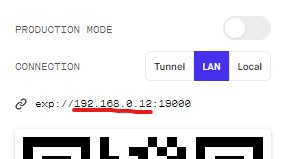
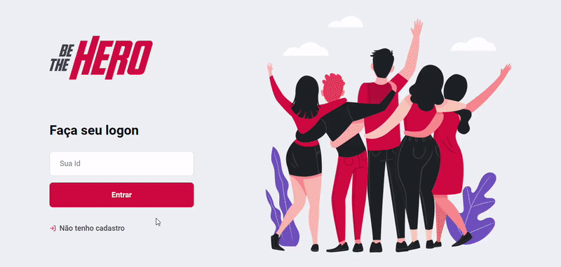

<h1 align="center">
  
</h1>

<h4 align="center"> 
   React, 
   React Native, 
   Node and 
   SQLite 
</h4>

<h3 align="center">Project created during the "Semana Omnistack 11" event with the purpose of facilitating the meeting of NGOs with people willing to support them.</h3>

The "Semana Omnistack" is an online event organized by [Rocketseat](https://rocketseat.com.br/), with exclusive and unprecedented content with duration of 5 days in sequence to develop an application from the ground with React, React Native and Node Js.
The 11° event happened between 23/03/20 and 27/03/20 and brought the idea of creating an application to help to connect NGOs with people willing to support them with donations.

[Layout](https://www.figma.com/file/2C2yvw7jsCOGmaNUDftX9n/Be-The-Hero---OmniStack-11?node-id=0:1) on Figma.

## Running the application
Run `npm install`  at backend, frontend and mobile folders to install the dependencies.

**Web version**

Run `npm start`  at backend and frontend, then open  **localhost:3000** at the browser.

**Mobile version**

Run `npm start`  at backend and mobile, then open **localhost:19002**.

Copy your lan ip without the port and paste into /mobile/src/services/api.js at baseURL config with port 3333.

Read the QR Code with your smartphone and use the [Expo](https://expo.io/) app to see the application running.

## Application

  
  

